# 正芯大屏 · 项目板块导图梳理

> 对照产品思维导图（养殖/生产、设备管理、监控实况、能耗检测、生产安全、经营效益）与当前 **aiot-web** 代码实现，统一归类、标注落点页面，并列出**导图外但项目已具备**的扩展板块。  
> 文档版本：2026-05-21

---

## 1. 总览对照

| 导图一级板块 | 项目覆盖 | 主要落点 | 备注 |
|-------------|---------|---------|------|
| 养殖 / 生产 | ✅ 已覆盖 | 舍详情 `BarnDetail` | 环控/存栏部分拆到「生物数据」「环境数据」独立面板 |
| 设备管理 | ✅ 已覆盖 | 舍详情 `BarnDetail` | 「设备详情」卡片区为导图子项，单独成 panel |
| 监控实况 | ✅ 已覆盖 | 监控点位、农场/舍内监控 | 三处入口，能力一致（占位流） |
| 能耗检测 | ✅ 已覆盖 | 舍详情 `BarnDetail` | 文案为「能耗监测」 |
| 生产安全 | ✅ 已覆盖 | 舍详情 `BarnDetail` | — |
| 经营效益 | ✅ 已覆盖 | 农场详情 `FarmDetail` | 厂长视角，场级汇总 |
| **（导图未列）** | ✅ 项目扩展 | 见 §4 | 大屏、报警闭环、订单、数据对比等 |

---

## 2. 逻辑结构图（Mermaid）

```mermaid
flowchart TB
  subgraph APP["AIOT 物联 Web"]
    direction TB

    subgraph NAV["系统导航 MainLayout"]
      M1["大屏可视化 /"]
      M2["农场详情 /farm"]
      M3["监控点位 /farm/monitor-detail"]
      M4["数据对比 /farm/comparison-detail"]
    end

    subgraph DASH["大屏可视化 Dashboard — 导图外"]
      D1["KPI 报警筛选"]
      D2["报警分布地图"]
      D3["实时报警 + 闭环"]
      D4["重点工厂 / 等级 / 类型"]
    end

    subgraph FARM["农场详情 FarmDetail"]
      F0["今日生产看板 — 导图外"]
      F0b["环境达标摘要 — 导图外"]
      F0c["KPI 条 — 导图外"]
      F1["经营效益"]
      F1a["经营总览"]
      F1b["成本分析"]
      F1c["销售业绩"]
      F2["数据监测 — 导图外"]
      F3["本厂报警 + 闭环 — 导图外"]
      F4["厂区监控"]
      F5["订单详情 / 履约 — 导图外"]
      F6["栏舍·车间列表 — 导图外"]
    end

    subgraph BARN["舍详情 BarnDetail — 导图核心"]
      B1["养殖与生产"]
      B1a["环控数据 → 环境数据"]
      B1b["养殖生产 → 生物数据"]
      B1c["饲喂采食"]
      B1d["生物防疫"]
      B1e["生产·饲料厂"]
      B1e1["原料管控"]
      B1e2["生产工艺管理"]
      B1e3["饲料出厂"]
      B2["生物数据 — 导图外细化"]
      B3["环境数据"]
      B4["舍内监控"]
      B5["设备管理"]
      B5a["在线情况"]
      B5b["运行参数"]
      B5c["故障报警"]
      B5d["设备详情 → 下方 panel"]
      B6["设备详情 panel"]
      B7["能耗监测"]
      B8["生产安全"]
    end

    subgraph EXT["独立详情页 — 导图外"]
      E1["报警详情 AlarmDetail"]
      E2["设备详情 DeviceDetail"]
      E3["监控点位 MonitorDetail"]
      E4["数据对比 ComparisonDetail"]
    end
  end

  M1 --> DASH
  M2 --> FARM
  M2 --> BARN
  M3 --> E3
  M4 --> E4
  F6 --> BARN

  F1 --> F1a & F1b & F1c
  B1 --> B1a & B1b & B1c & B1d & B1e
  B1e --> B1e1 & B1e2 & B1e3
  B5 --> B5a & B5b & B5c & B5d
  B7 --> B7s["能耗统计"] & B7a["能耗报警"] & B7p["排污与环保"]
  B8 --> B8o["超限报警"] & B8e["突发事件与处置"] & B8r["应急资源管理"]
```



---

## 3. 导图板块 · 逐项落点

### 3.1 养殖 / 生产

| 导图节点 | 子项 | 页面 | 组件/区域 | 状态 |
|---------|------|------|-----------|------|
| 养殖 | 环控数据 · 实时环控 | 舍详情 | `环境数据` → 8 项实时指标 | ✅ |
| 养殖 | 环控数据 · 环控趋势 | 舍详情 | `环境数据` → 近 30 日趋势图 | ✅ |
| 养殖 | 养殖生产 · 存栏/日龄/品类 | 舍详情 | `生物数据` + `养殖与生产` KPI | ✅ |
| 养殖 | 养殖生产 · 产子/死淘/生产率/成活率/死亡率 | 舍详情 | `生物数据` + `养殖与生产` | ✅ |
| 养殖 | 饲喂采食 · 饲喂量/增重/料肉比 | 舍详情 | `养殖与生产` → 饲喂采食 | ✅ |
| 养殖 | 饲喂采食 · 鸡场产蛋/产蛋率 | 舍详情 | `生物数据` 专览（鸡舍） | ✅ |
| 养殖 | 饲喂采食 · 异常采食量报警 | 舍详情 | `养殖与生产` → 饲喂采食 | ✅ |
| 养殖 | 生物防疫 · 防疫消杀记录 | 舍详情 | `养殖与生产` → 生物防疫 | ✅ |
| 养殖 | 生物防疫 · 疫苗使用记录 | 舍详情 | 同上 | ✅ |
| 养殖 | 生物防疫 · 体温记录 | 舍详情 | 同上（水产/饲料厂为水温/环境温度） | ✅ |
| 养殖 | 生物防疫 · 异常行为/体征报警 | 舍详情 | 同上 | ✅ |
| 养殖 | 生物防疫 · 疫情状态/疫情报警 | 舍详情 | 同上 → 疫情报警 | ✅ |
| 生产 | 原料管控 · 原料入场 | 舍详情 | `养殖与生产` → 生产（饲料厂） | ✅ |
| 生产 | 原料管控 · 原料存量 | 舍详情 | 同上 | ✅ |
| 生产 | 生产工艺管理 · 工艺图纸/参数 | 舍详情 | 同上 | ✅ |
| 生产 | 饲料出厂 · 批次/产量/合格率 | 舍详情 | 同上 | ✅ |
| 生产 | 饲料出厂 · 产量统计/库存数据 | 舍详情 | 同上 | ✅ |

### 3.2 设备管理

| 导图节点 | 页面 | 组件/区域 | 状态 |
|---------|------|-----------|------|
| 在线情况 · 在线率 | 舍详情 | `设备管理` → 在线率进度条 | ✅ |
| 在线情况 · 离线设备列表 | 舍详情 | `设备管理` → 离线表格 | ✅ |
| 运行参数 | 舍详情 | `设备管理` → 运行参数表；`设备详情` → 卡片内参数 | ✅ |
| 故障报警 | 舍详情 | `设备管理` → 故障报警列表 | ✅ |
| 设备详情 | 舍详情 | `设备详情` panel（卡片、开关只读、维保） | ✅ |

### 3.3 监控实况

| 导图节点 | 页面 | 说明 | 状态 |
|---------|------|------|------|
| 监控实况 | 监控点位 `MonitorDetail` | 单路大画面、摄像头切换 | ✅ 占位 |
| 监控实况 | 农场详情 | `厂区监控` CameraPanel | ✅ 占位 |
| 监控实况 | 舍详情 | `舍内监控` CameraPanel | ✅ 占位 |

### 3.4 能耗检测（项目称「能耗监测」）

| 导图节点 | 页面 | 状态 |
|---------|------|------|
| 能耗统计 | 舍详情 → `能耗监测` | ✅ |
| 能耗报警 · 异常波动/超定额 | 舍详情 → `能耗监测` | ✅ |
| 排污与环保指标 | 舍详情 → `能耗监测` | ✅ |

### 3.5 生产安全

| 导图节点 | 页面 | 状态 |
|---------|------|------|
| 超限报警 · 环控/设备/其他 | 舍详情 → `生产安全` | ✅ |
| 突发事件与处置 | 舍详情 → `生产安全` | ✅ |
| 应急资源管理 · 消防/应急物资 | 舍详情 → `生产安全` | ✅ |

### 3.6 经营效益

| 导图节点 | 页面 | 状态 |
|---------|------|------|
| 经营总览 · 存栏/出栏/交易/产值 | 农场详情 → `经营效益` | ✅ |
| 成本分析 | 农场详情 → `经营效益` | ✅ |
| 销售业绩 | 农场详情 → `经营效益` | ✅ |

---

## 4. 项目独有板块（导图未列，已实现）

以下能力不在产品思维导图六个一级节点内，但已在项目中落地，按**页面**归类。

### 4.1 大屏可视化 `Dashboard.vue`（路由 `/`）

| 板块 | 说明 |
|------|------|
| 顶栏 | 返回后台、标题、更新时间、全屏 |
| KPI 条 | 当前报警 / 严重 / 涉及工厂 / 今日新增 / 未处理 |
| 报警分布地图 | 全国→省→市下钻，工厂跳转农场详情 |
| 实时报警列表 | 等级、闭环状态、负责人、持续时长 |
| 重点工厂 TOP5 | 报警数排行 |
| 报警等级占比 | 严重 / 一般 / 提示 |
| 报警类型占比 | 各类型数量条 |

### 4.2 农场详情 `FarmDetail.vue`（路由 `/farm`）

| 板块 | 说明 |
|------|------|
| 组织上下文 | 页头工厂名、场类型、运行状态 |
| 今日生产看板 | 厂长晨会指标（死淘、消耗、异常舍、批次等） |
| 环境达标摘要 | 全厂达标率、最差舍、未处理报警 |
| KPI 条 | 栏舍总数、报警、离线设备等，联动列表 |
| 数据监测 | 全厂近 30 日 ECharts，按舍/品种筛选 |
| 本厂报警 | 列表 + **报警闭环**（状态、负责人、响应时间） |
| 订单详情 | 订单表 + **履约统计**（今日待交、周/月履约率） |
| 栏舍/车间列表 | 卡片网格，入口进入舍详情 |

### 4.3 舍详情 · 导图外细化面板 `BarnDetail.vue`

| 板块 | 与导图关系 |
|------|-----------|
| 生物数据 | 导图「养殖生产」的**舍级深化**：批次栏、专览指标、7 日趋势、批次曲线 |
| 环境数据 | 导图「环控数据」的**独立 panel**（达标率、偏离时长） |
| 设备详情 panel | 导图「设备详情」的**卡片化展示**（与「设备管理」并列，互为引用） |

### 4.4 独立详情页（路由在侧栏或页头跳转）

| 页面 | 路由 | 板块 |
|------|------|------|
| 报警详情 | `/farm/alarm-detail` | 日期筛选、报警统计、栏舍趋势图、列表、Excel 导出 |
| 设备详情 | `/farm/device-detail` | 设备类型统计、仪器列表、保温灯分布图与详情弹窗 |
| 监控点位 | `/farm/monitor-detail` | 单工厂监控大画面 |
| 数据对比 | `/farm/comparison-detail` | 全平台区域分析、本厂对标、成本指标、区域/省份图表与表格 |

### 4.5 基础设施（非业务板块）

| 模块 | 路径 | 说明 |
|------|------|------|
| 系统侧栏 | `MainLayout.vue` | 大屏 / 农场 / 监控 / 对比 |
| 组织树 | `LayoutWithSidebar.vue` | 公司树、场类型、关键字过滤 |
| 全局状态 | `useCompanyTree.ts` | 当前工厂、场类型共享 |
| 最小宽度 | `style.css` | `--app-min-width: 1280px` 防 UI 挤压变形 |

---

## 5. 页面 × 板块矩阵

| 板块大类 | Dashboard | FarmDetail | BarnDetail | AlarmDetail | DeviceDetail | MonitorDetail | ComparisonDetail |
|---------|:---------:|:----------:|:----------:|:-----------:|:------------:|:-------------:|:----------------:|
| 导图·养殖/生产 | | | ✅ | | | | |
| 导图·设备管理 | | | ✅ | | ✅ | | |
| 导图·监控实况 | | ✅ | ✅ | | | ✅ | |
| 导图·能耗检测 | | | ✅ | | | | |
| 导图·生产安全 | | | ✅ | | | | |
| 导图·经营效益 | | ✅ | | | | | |
| 报警监控/闭环 | ✅ | ✅ | | ✅ | | | |
| 订单履约 | | ✅ | | | | | |
| 区域数据对比 | | | | | | | ✅ |
| 今日生产看板 | | ✅ | | | | | |
| 环境达标摘要 | | ✅ | ✅ | | | | |
| 生物/批次深化 | | | ✅ | | | | |

---

## 6. 板块树 JSON（机器可读）

```json
{
  "productMindMap": {
    "养殖生产": {
      "养殖": {
        "环控数据": ["实时环控", "环控趋势"],
        "养殖生产": ["存栏日龄品类", "产子死淘", "生产率", "成活率", "死亡率"],
        "饲喂采食": ["饲喂量", "增重量", "料肉比料蛋比", "异常采食量报警"],
        "生物防疫": ["防疫消杀", "疫苗使用", "体温记录", "异常行为体征", "疫情报警"]
      },
      "生产": {
        "原料管控": ["原料入场", "原料存量"],
        "生产工艺管理": ["工艺图纸", "工艺参数"],
        "饲料出厂": ["批次产量合格率", "产量统计", "库存数据"]
      }
    },
    "设备管理": ["在线情况", "运行参数", "故障报警", "设备详情"],
    "监控实况": ["单路监控", "厂区监控", "舍内监控"],
    "能耗检测": ["能耗统计", "能耗报警", "排污与环保指标"],
    "生产安全": ["超限报警", "突发事件与处置", "应急资源管理"],
    "经营效益": ["经营总览", "成本分析", "销售业绩"]
  },
  "projectOnly": {
    "大屏可视化": {
      "route": "/",
      "view": "Dashboard.vue",
      "sections": ["KPI筛选", "报警分布地图", "实时报警", "报警闭环", "重点工厂", "报警等级", "报警类型"]
    },
    "农场运营": {
      "route": "/farm",
      "view": "FarmDetail.vue",
      "sections": ["今日生产看板", "环境达标摘要", "KPI条", "数据监测", "本厂报警", "订单详情", "栏舍列表"]
    },
    "舍级深化": {
      "route": "/farm/barn-detail",
      "view": "BarnDetail.vue",
      "sections": ["生物数据", "环境数据独立面板", "设备详情卡片区"]
    },
    "报警详情": {
      "route": "/farm/alarm-detail",
      "view": "AlarmDetail.vue",
      "sections": ["报警统计", "栏舍趋势图", "报警列表", "Excel导出"]
    },
    "工厂设备详情": {
      "route": "/farm/device-detail",
      "view": "DeviceDetail.vue",
      "sections": ["设备类型统计", "仪器列表", "保温灯分布与详情"]
    },
    "数据对比": {
      "route": "/farm/comparison-detail",
      "view": "ComparisonDetail.vue",
      "sections": ["概览KPI", "本厂区域对标", "成本指标", "区域工厂数", "存栏TOP5", "报警TOP5", "场类型分布", "区域综合对比", "省份明细"]
    }
  },
  "implementationMap": [
    {
      "mindMapNode": "养殖.环控数据",
      "primaryView": "BarnDetail.vue",
      "uiBlock": "环境数据",
      "note": "养殖与生产内为指引链接"
    },
    {
      "mindMapNode": "养殖.养殖生产",
      "primaryView": "BarnDetail.vue",
      "uiBlock": "生物数据 + 养殖与生产",
      "note": "存栏日龄在生物数据，率类在养殖与生产"
    },
    {
      "mindMapNode": "经营效益",
      "primaryView": "FarmDetail.vue",
      "uiBlock": "经营效益",
      "note": "场级汇总，非舍级"
    },
    {
      "mindMapNode": "设备管理.设备详情",
      "primaryView": "BarnDetail.vue",
      "uiBlock": "设备管理 + 设备详情",
      "note": "管理侧表格与卡片详情分 panel"
    }
  ]
}
```

---

## 7. 路由与入口速查

```
/                          大屏可视化（报警监控）
/farm                      农场详情（经营效益、看板、订单、监控…）
/farm/barn-detail          舍详情（导图六类核心 + 生物/环境深化）
/farm/alarm-detail         报警详情（扩展）
/farm/device-detail        工厂设备详情（扩展）
/farm/monitor-detail       监控点位（导图·监控实况）
/farm/comparison-detail    数据对比（扩展）
```

**跳转关系**

- 大屏地图 / 列表 → 农场详情
- 农场栏舍卡片 / 报警项 → 舍详情
- 农场页头 → 大屏、报警详情、设备详情
- 大屏「实时报警」标题 → 报警详情

---

## 8. 数据与 Mock 来源

| 板块类型 | Mock 文件 |
|---------|-----------|
| 厂长运营（看板、环境、订单、对标、成本、经营效益） | `src/utils/farmOperationsMock.ts` |
| 区域对比 | `src/utils/comparisonMockData.ts` |
| 摄像头 | `src/utils/cameraMockData.ts` |
| 地图报警 | `src/utils/chinaMapConfig.ts` + Dashboard 内联 |
| 舍详情各子板块 | `BarnDetail.vue` 内 computed + `farmOperationsMock.ts` |

---

## 9. 结论摘要

1. **导图六个一级板块均已实现**，核心数据落在 **舍详情**；**经营效益**落在 **农场详情**；**监控实况**三处入口。
2. **项目显著大于导图**：大屏报警体系、厂长今日看板、订单履约、数据对比、报警/设备独立详情页等均为**运营与管理层扩展**。
3. **同一导图节点可能对应多个 UI panel**（如环控 → 环境数据；养殖生产 → 生物数据 + 养殖与生产），文档 §3 表格为权威对照。
4. 后续若产品导图增补「报警闭环 / 订单 / 区域对比」等节点，可直接将 §4 条目迁入 §3 对应一级分类。

---

*关联文档：[系统说明.md](./系统说明.md)*
